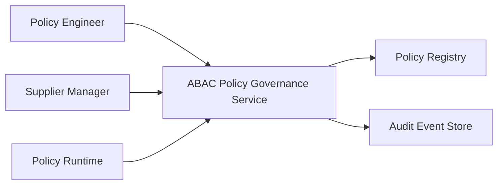
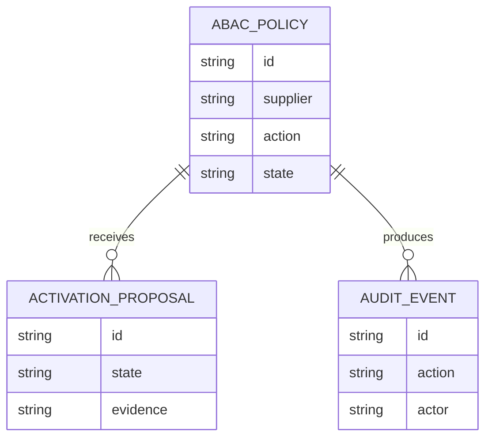
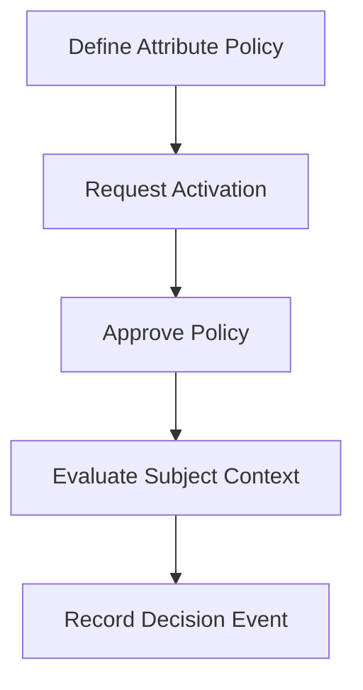
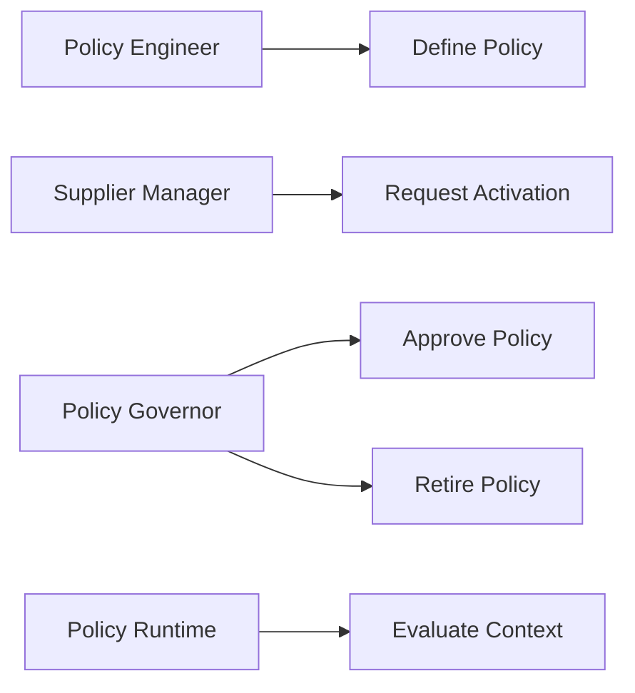
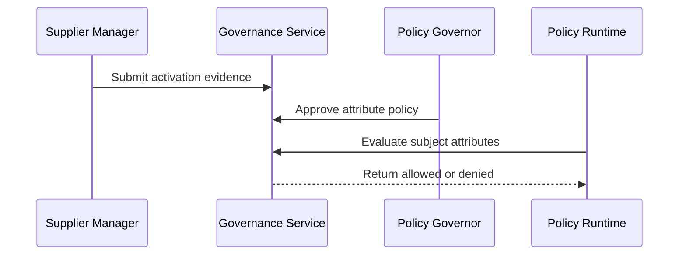

# ABAC Supplier Policy Governance Platform

## The Problem
Supplier access conditions can change by region, relationship tier, and business purpose. Static roles alone cannot reliably capture these constraints or show how a context-specific decision was made.

## The Solution
This service governs attribute based supplier access policies. Policy engineers define required attributes, supplier managers request activation with evidence, policy governors approve deployment, and runtime evaluation records every allowed or denied decision.

## Live Demo & Tech Stack
The LAN health endpoint is available at `http://0.0.0.0:26400/health`. The implementation uses Node.js, Express, Vitest, GitHub Actions, and governed attribute based access control.

## Local Setup & Run Instructions
```bash
npm install
npm test
npm start
curl http://127.0.0.1:26400/health
```

## System Documentation (Mermaid.js)
### System Architecture Diagram

### Entity-Relationship Diagram (ERD)

### Data Flow Diagram

### Use Case Diagram

### Sequence Diagram


## Owner
Created and maintained by Kholipha Ahmmad Al-Amin.
Software Engineer and AI Specialist
Founder and CEO of EquiSaaS BD
Principal Consultant at AR IT Consultancy
Full Stack Developer and SaaS Product Builder
### Official links
Portfolio: https://kholipha-ahmmad-al-amin.equisaas-bd.com/
GitHub: https://github.com/kholipha-ahmmad-al-amin
LinkedIn: https://www.linkedin.com/in/kholipha-ahmmad-al-amin
X: https://x.com/al_amin5519
Facebook: https://www.facebook.com/kholipha.ahmmad.al.amin
Instagram: https://www.instagram.com/kholipha.ahmmad.al.amin
## Ownership
This project was created and is maintained by Kholipha Ahmmad Al-Amin.

